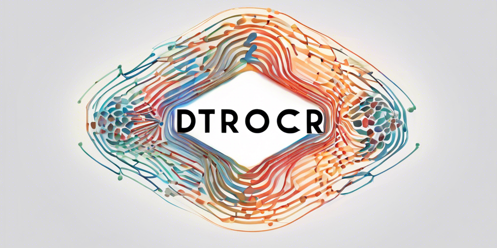

# DTrOCR

[](https://github.com/arvindrajan92/DTrOCR/actions/workflows/python-app.yml)
[](https://github.com/arvindrajan92/DTrOCR/actions/workflows/github-code-scanning/codeql)
[](https://www.python.org/downloads/)
[](https://github.com/arvindrajan92/DTrOCR/LICENSE)
[](https://github.com/arvindrajan92/DTrOCR)

A PyTorch implementation of DTrOCR: Decoder-only Transformer for Optical Character Recognition.

> [!NOTE]
>
> The authors of this repository are not affiliated with the author of the [DTrOCR paper](https://doi.org/10.48550/arXiv.2308.15996). This implementation is independently developed, relying solely on the publicly available descriptions of the DTrOCR model architecture and its training methodologies, with a specific focus on printed and handwritten words.
> 
> Due to the project's inception as a personal endeavor with limited resources, the pre-trained weights for the model are not presently accessible. However, there is an ongoing commitment to pre-train the model and subsequently release the weights to the public. For detailed insights into the project's development and future milestones, please refer to the [project roadmap](https://github.com/users/arvindrajan92/projects/1).

The table below outlines the principal distinctions between the implementation described in the original paper and the current implementation.

|                                                             | Original implementation      | Current implementation |
|-------------------------------------------------------------| ---------------------------- |------------------------|
| Maximum token length<br />(including 128 image patch tokens)| 512                          | 256                    |
| Supported language(s)                                       | English & Chinese            | English                |
| Pre-training corpus (planned)                               | Scene, printed & handwritten | Printed & handwritten  |

## Installation

```shell
git clone https://github.com/arvindrajan92/DTrOCR
cd DTrOCR
pip install -r requirements.txt
```

## Usage

```python
from dtrocr.config import DTrOCRConfig
from dtrocr.model import DTrOCRLMHeadModel
from dtrocr.processor import DTrOCRProcessor

from PIL import Image

config = DTrOCRConfig()
model = DTrOCRLMHeadModel(config)
processor = DTrOCRProcessor(DTrOCRConfig())

model.eval()        # set model to evaluation mode for deterministic behaviour
path_to_image = ""  # path to image file

inputs = processor(
    images=Image.open(path_to_image).convert('RGB'),
    texts=processor.tokeniser.bos_token,
    return_tensors="pt"
)

model_output = model.generate(
    inputs=inputs, 
    processor=processor, 
    num_beams=3,    # defaults to 1 if not specified
    use_cache=True  # defaults to True if not specified
)

predicted_text = processor.tokeniser.decode(model_output[0], skip_special_tokens=True)
```
## Acknowledgments
This project builds upon the original work presented in [DTrOCR: Decoder-only Transformer for Optical Character Recognition](https://doi.org/10.48550/arXiv.2308.15996), authored by Masato Fujitake. We extend our gratitude for their significant contributions to the field.

Additionally, we leverage the GPT-2 and Vision Transformer (ViT) models developed by Hugging Face, which have been instrumental in advancing our project's capabilities. Our sincere thanks go to the Hugging Face team for making such powerful tools accessible to the broader research community.
